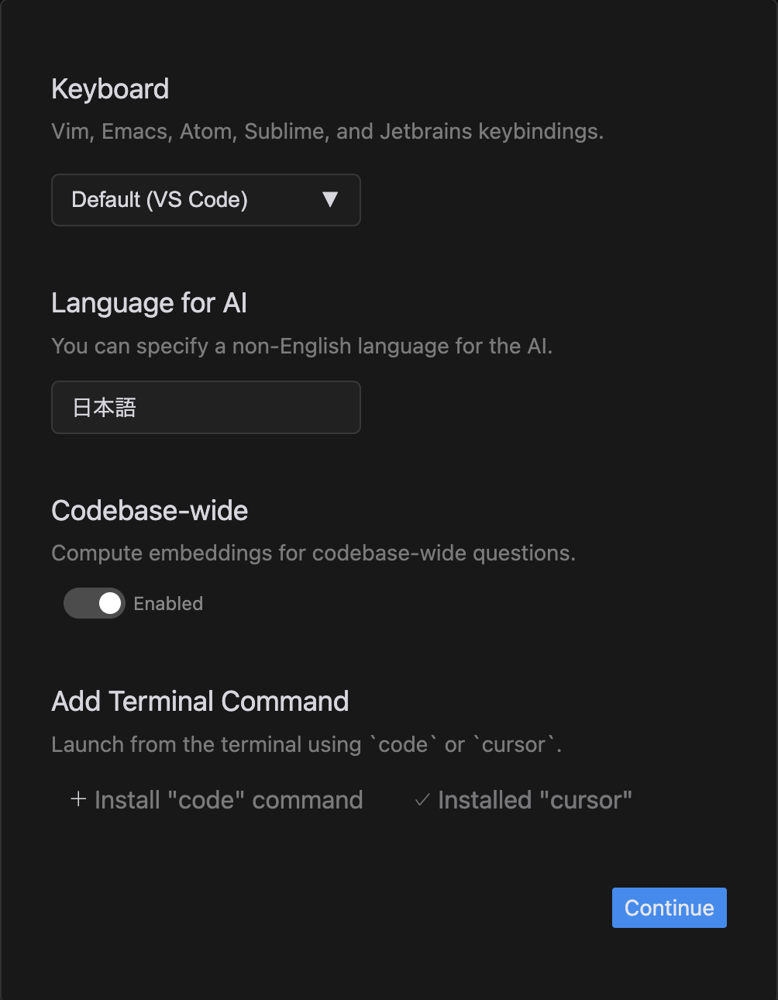

# インストール
[公式サイト](https://www.cursor.com/)からインストールする

# 起動のための設定
インストールすると、こんな画面になるので、設定を行う。

- Language for AI: AIに入力する言語を書いておく
- Codebase-wide: コードベース全体をエンべディング(埋め込み)するかどうか。これを有効にすると、プロジェクトのコード全体に対してAI検索が適用されるようになる。(コード全体を読み取られたくない場合は無効にする)
- Add Terminal Command: ターミナルにコマンドを追加する。これを有効にすると、ターミナルに`cursor`と入力するだけで、cursorが起動するようになる。vscodeの`code.`のようなもの。(私はVSCodeと使い分けたいため、cursorのみをインストール。)

Continueをクリックすると、VSCodeの拡張機能をインポートするかの選択がある。User Extensionsをクリックすると、自動的にVSCodeの拡張機能がインストールされる。

VSCodeでGithub Copilotを使用している場合は、以下のような画面がでる。CursorのCopilot++っていうCopilotよりもイケイケのものでoverrideするけどええか？って聞いている。今回はそれでokなので、Continue with Defaultをクリック。

**1番重要なところ**データをOpenAIに送信するかどうかの設定に移る。デフォルトでは送信されるようになっているので要注意。今回は送信したくないので、Privacy ModeにしてContinueをクリック。

すると、ログインやサインアップを求められるので、サインアップを行う。

ログインすると、VSCodeとほぼ同じ画面がでてくる。これにて起動の設定は終了！

